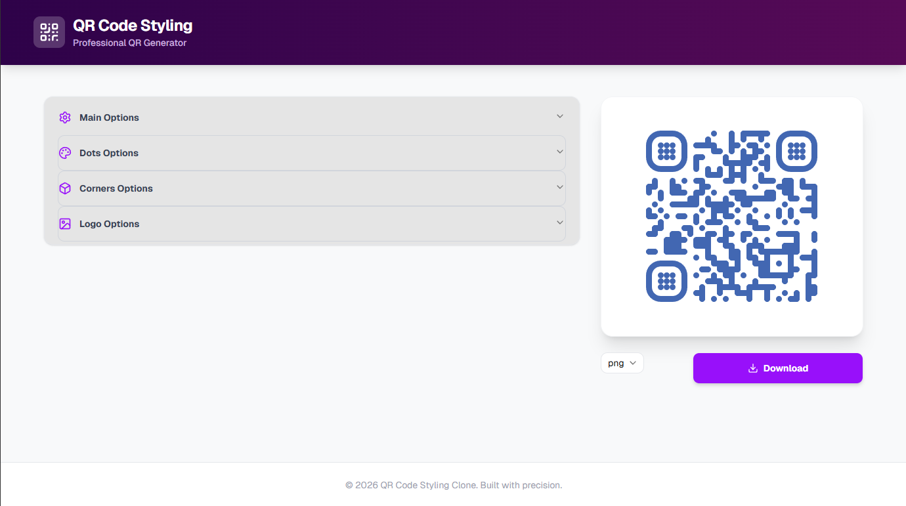
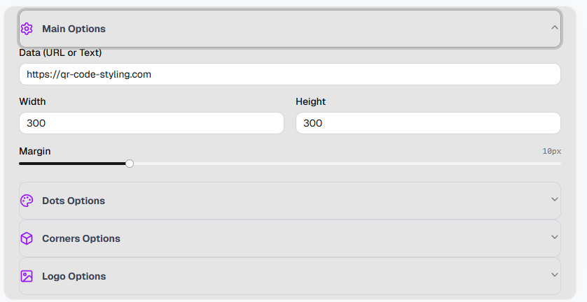

# 🎨 QR Code Styling Clone


A professional and highly customizable QR Code generator built with React and `qr-code-styling`. This project is a faithful clone of the popular QR Code Styling tool, focusing on clean code, rapid prototyping (Vibecoding), and a polished user interface.

## 📸 Preview

### Main Interface


### Key Features and Customization


## ✨ Features

- **Real-time Preview**: See changes instantly as you adjust configurations.
- **Custom Data**: Generate QR codes for any URL or text.
- **Advanced Styling**:
  - **Dots**: Multiple types (dots, rounded, classy, etc.) and custom colors.
  - **Corners**: Independent styling for corner squares and dots.
  - **Background**: Customizable background colors.
- **Logo Integration**: Upload your own logo, adjust its size, and set margins.
- **High-Quality Export**: Download your QR codes in **PNG, JPEG, WEBP, or SVG** formats.
- **Responsive Design**: Polished UI that works on desktop and mobile.

## 🛠️ Tech Stack

- **Framework**: [React 19](https://react.dev/) + [Vite](https://vitejs.dev/)
- **Styling**: [Tailwind CSS](https://tailwindcss.com/)
- **UI Components**: [Shadcn UI](https://ui.shadcn.com/) (Accordion, Input, Select, Slider, etc.)
- **State Management**: [Zustand](https://github.com/pmndrs/zustand)
- **Icons**: [Lucide React](https://lucide.dev/)
- **QR Engine**: [qr-code-styling](https://github.com/kozakdenys/qr-code-styling)

## 🚀 Getting Started

1. **Install dependencies**:
   ```bash
   npm install
   ```

2. **Run the development server**:
   ```bash
   npm run dev
   ```

3. **Build for production**:
   ```bash
   npm run build
   ```

## 📄 License

This project is open-source and available under the MIT License.
